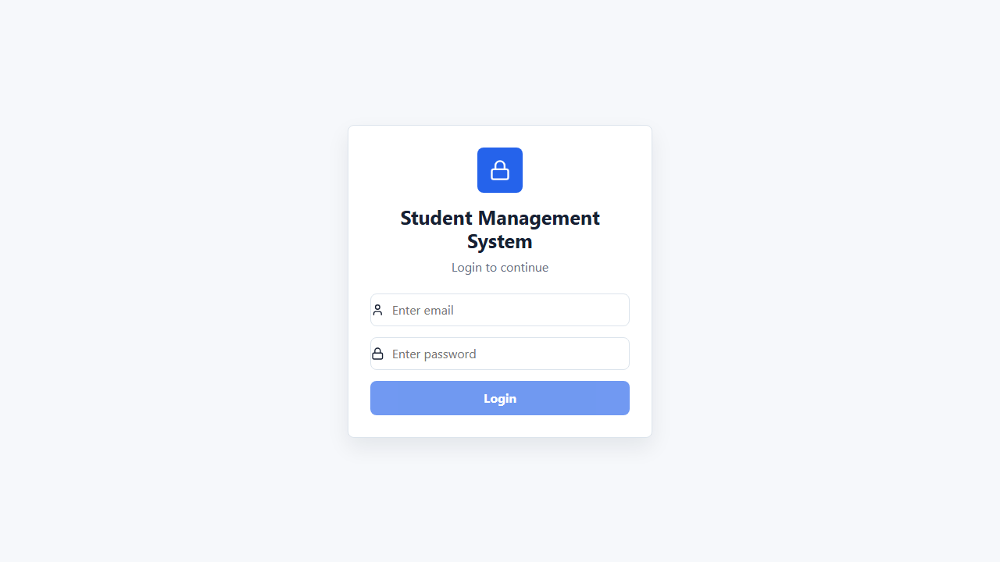
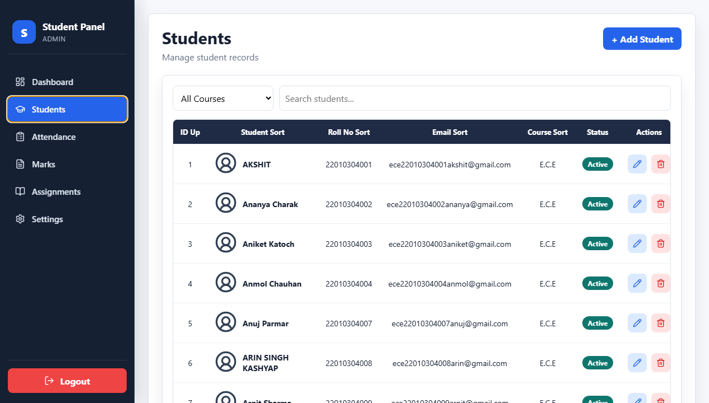
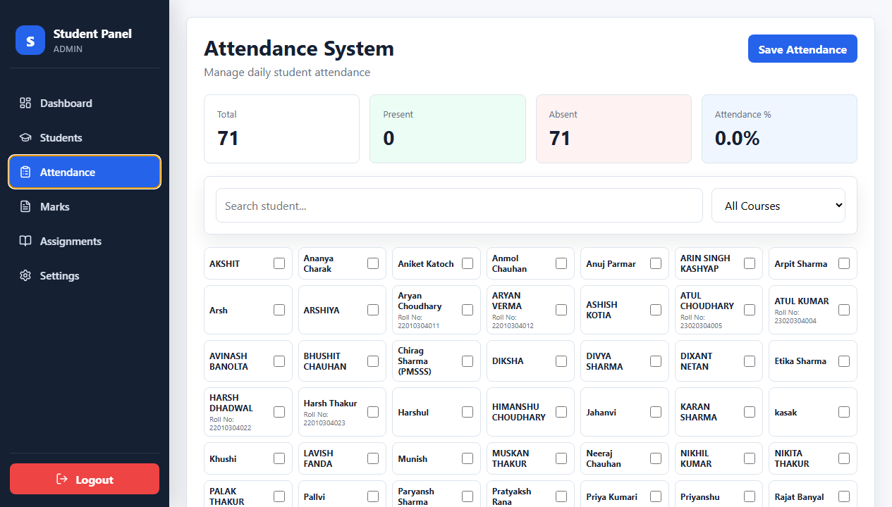
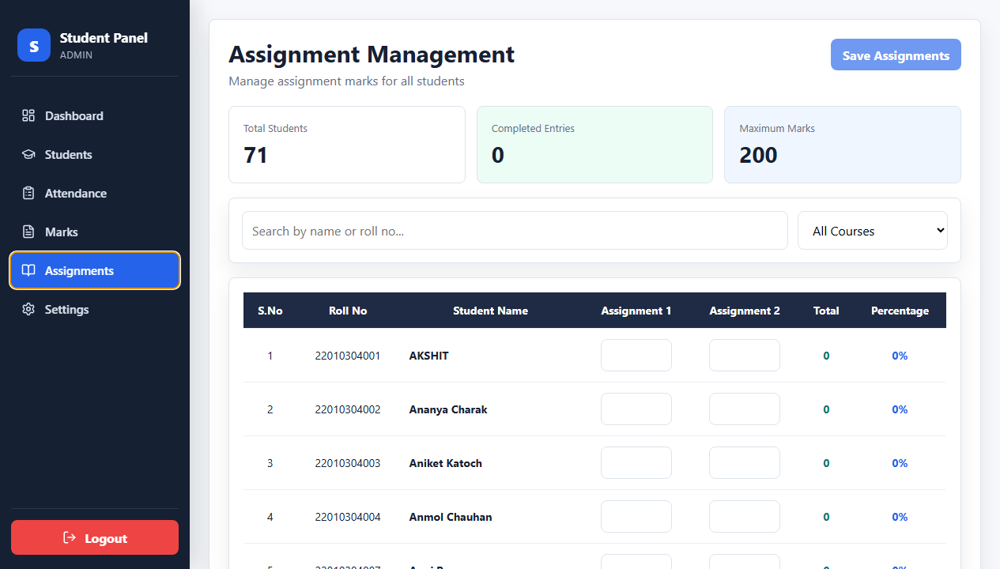
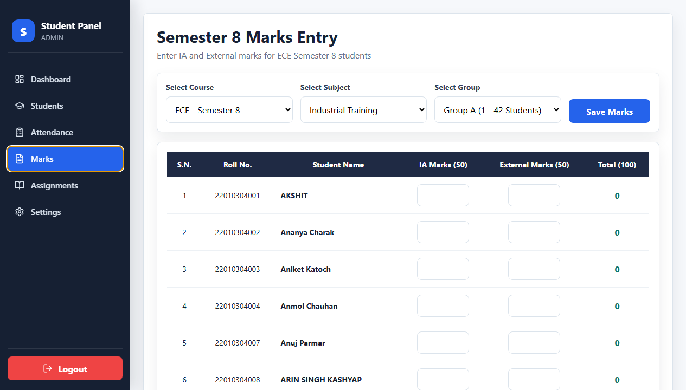

# Student Management Dashboard

## Project Documentation and College Report

**Project Title:** Student Management Dashboard  
**Project Type:** Web Application  
**Frontend Technology:** React.js with TypeScript  
**Backend/Database:** Supabase  
**UI Libraries:** Recharts, Lucide React, SweetAlert2  
**Build Tool:** Create React App  
**Submitted For:** College Project Presentation  

---

## 1. Abstract

The Student Management Dashboard is a web-based application designed to simplify student record management, attendance marking, assignment tracking, marks entry, and student profile handling. The system provides role-based access for admin, teacher, and student users. It uses a modern dashboard interface with responsive pages, visual charts, searchable tables, and clean user interaction flows.

The application is built using React.js and TypeScript for a structured frontend, Supabase for cloud database operations, Recharts for analytics graphs, and SweetAlert2 for user-friendly alerts. The project focuses on reducing manual academic record work and improving accessibility of student-related information.

---

## 2. Introduction

Educational institutions manage a large amount of student data such as personal details, attendance, assignments, and marks. Manual record keeping can be time-consuming, repetitive, and error-prone. A digital dashboard helps teachers and administrators manage this data more efficiently.

This project provides a centralized platform where:

- Admins and teachers can manage students.
- Attendance can be marked daily.
- Assignment marks can be entered and saved.
- Semester marks can be managed.
- Students can view or update their personal information.
- Dashboard charts provide quick academic insights.

The project is responsive, so it works on desktop, tablet, and mobile screens.

---

## 3. Problem Statement

Many colleges and departments still manage student records through registers, spreadsheets, or separate tools. This creates problems such as:

- Difficulty in finding student details quickly.
- Repeated manual entry of attendance and marks.
- No centralized view of academic performance.
- Limited accessibility for students.
- Higher chances of data duplication or human error.

The Student Management Dashboard solves this by providing a single digital platform for managing student-related academic activities.

---

## 4. Objectives

The main objectives of this project are:

1. To create a centralized student management system.
2. To provide role-based access for admin, teacher, and student users.
3. To maintain student records with add, edit, delete, search, sort, and pagination features.
4. To provide an attendance marking module with compact student cards.
5. To allow assignment and marks entry in structured forms.
6. To show dashboard analytics using graphs and charts.
7. To make the user interface simple, responsive, and easy to use.
8. To connect the application with a cloud database using Supabase.

---

## 5. Scope of the Project

This project can be used by small colleges, departments, training institutes, and classroom-level academic systems. It supports essential academic management operations.

### In Scope

- Login authentication.
- Student record management.
- Attendance management.
- Assignment marks management.
- Semester marks entry.
- Student profile viewing and updating.
- Dashboard analytics.
- Responsive UI design.

### Out of Scope

- Online fee payment.
- Automatic timetable generation.
- Biometric attendance.
- Advanced analytics using machine learning.
- Production-level encrypted password authentication.

---

## 6. Technology Stack

| Layer | Technology | Purpose |
|---|---|---|
| Frontend | React.js | Component-based UI development |
| Language | TypeScript | Type safety and maintainable code |
| Routing | React Router DOM | Page navigation |
| Database | Supabase | Cloud database and backend API |
| Charts | Recharts | Dashboard graphs and analytics |
| Icons | Lucide React | Clean UI icons |
| Alerts | SweetAlert2 | User-friendly confirmation and success messages |
| Styling | CSS and inline styles | Responsive layout and UI design |
| Build Tool | React Scripts | Development and production build |

---

## 7. System Requirements

### Hardware Requirements

- Processor: Intel i3 or above
- RAM: Minimum 4 GB
- Storage: 500 MB free space
- Internet connection for Supabase database access

### Software Requirements

- Node.js
- npm
- Modern web browser such as Chrome, Edge, or Firefox
- Code editor such as Visual Studio Code

---

## 8. Project Folder Structure

```text
student-dashboard/
  public/
    index.html
    manifest.json
  src/
    components/
      Navbar.tsx
      Sidebar.tsx
      StudentModal.tsx
      StudentTable.tsx
    context/
      AuthContext.tsx
    pages/
      Dashboard.tsx
      students.tsx
      Attendance.tsx
      Assignments.tsx
      Marks.tsx
      login.tsx
      signup.tsx
      personalinfo.tsx
      studentInformation.tsx
      Myprofile.tsx
      settings.tsx
      FacultyStaff.tsx
    services/
      api.ts
      auth.ts
    types/
      Student.ts
    App.tsx
    App.css
    index.tsx
    supabaseClient.ts
  package.json
  README.md
```

---

## 9. Main Modules

### 9.1 Authentication Module

The authentication module handles user login and session management. Users log in using email and password. The authenticated user is saved in local storage and made available across the application using `AuthContext`.

Key files:

- `src/pages/login.tsx`
- `src/context/AuthContext.tsx`
- `src/services/auth.ts`

Features:

- Login form with email and password.
- Role-based redirect after login.
- Local session storage.
- Logout support through the sidebar.

Roles:

- Admin
- Teacher
- Student

---

### 9.2 Dashboard Module

The dashboard module provides a summary view of the academic system. It displays important statistics and charts.

Key file:

- `src/pages/Dashboard.tsx`

Dashboard features:

- Total students count.
- Attendance percentage.
- Total courses count.
- Total assignments count.
- Attendance overview chart.
- Assignment completion donut chart.
- Students per course chart.
- Marks trend chart.
- Attendance trend chart.
- Events and notices.

The dashboard is responsive and uses Recharts for modern visual representation.

---

### 9.3 Student Management Module

The student management module allows admin and teacher users to manage student records.

Key files:

- `src/pages/students.tsx`
- `src/components/StudentTable.tsx`
- `src/components/StudentModal.tsx`

Features:

- Add student.
- Edit student.
- Delete student.
- Search student by name, email, or roll number.
- Filter student by course.
- Sort by ID, name, roll number, email, or course.
- Pagination with 10 students shown by default.
- Status badge for active/inactive students.
- Student profile detail modal.

Fields:

- ID
- Roll number
- Name
- Email
- Course
- Status

---

### 9.4 Attendance Module

The attendance module allows teachers or admins to mark daily attendance.

Key file:

- `src/pages/Attendance.tsx`

Features:

- Filter students by course.
- Search students by name or roll number.
- Mark present/absent using checkbox.
- Compact student cards.
- Roll number appears only when students have the same starting/first name.
- Attendance percentage calculation.
- Save attendance to Supabase.

Attendance status:

- Present
- Absent

---

### 9.5 Assignment Module

The assignment module allows assignment marks to be entered for students.

Key file:

- `src/pages/Assignments.tsx`

Features:

- Assignment 1 marks entry.
- Assignment 2 marks entry.
- Total assignment marks calculation.
- Percentage calculation.
- Search and course filter.
- Save assignment data.
- Responsive table layout.

Maximum assignment marks:

- Assignment 1: 100
- Assignment 2: 100
- Total: 200

---

### 9.6 Marks Module

The marks module is used for semester marks entry.

Key file:

- `src/pages/Marks.tsx`

Features:

- Course selection.
- Subject selection.
- Group selection.
- IA marks entry.
- External marks entry.
- Total marks calculation.
- Local storage support.
- Responsive table design.

Maximum marks:

- IA: 50
- External: 50
- Total: 100

---

### 9.7 Student Profile Module

The student profile module allows student users to view and update their personal information.

Key file:

- `src/pages/personalinfo.tsx`

Features:

- View name, email, roll number, and course.
- Update profile information.
- Upload profile image.
- Validate image type and size.
- Save profile information to Supabase.

Supported image formats:

- PNG
- JPG
- JPEG
- WEBP

Maximum image size:

- 2 MB

---

## 10. Database Design

The project uses Supabase tables for storing data.

### 10.1 profiles Table

| Field | Description |
|---|---|
| id | Unique profile ID |
| name | User name |
| email | User email |
| password | User password |
| role | User role: admin, teacher, or student |

### 10.2 students Table

| Field | Description |
|---|---|
| id | Unique student ID |
| user_id | Linked user ID |
| name | Student name |
| rollno | Student roll number |
| email | Student email |
| course | Student course |
| status | Active or Inactive |
| image | Profile image URL |

### 10.3 attendance Table

| Field | Description |
|---|---|
| id | Unique attendance record ID |
| student_id | Linked student ID |
| student_name | Student name |
| date | Attendance date |
| status | Present or Absent |

### 10.4 assignments Table

| Field | Description |
|---|---|
| id | Unique assignment record ID |
| student_id | Linked student ID |
| student_name | Student name |
| assignment1 | Assignment 1 marks |
| assignment2 | Assignment 2 marks |
| total_assignment | Total assignment marks |
| percentage | Assignment percentage |
| submission_date | Assignment submission date |

### 10.5 marks Table

| Field | Description |
|---|---|
| id | Unique marks record ID |
| student_id | Linked student ID |
| student_name | Student name |
| mst1 | MST 1 marks |
| mst2 | MST 2 marks |

---

## 11. System Architecture

```text
User
  |
  v
React Frontend
  |
  |-- React Router for navigation
  |-- AuthContext for user session
  |-- Components for UI
  |
  v
Service Layer
  |
  |-- api.ts
  |-- auth.ts
  |
  v
Supabase Database
```

The frontend communicates with Supabase through service functions. Pages do not directly contain all database logic; common operations are placed inside the service layer.

---

## 12. Data Flow

### Login Flow

1. User enters email and password.
2. Login page calls `signInUser`.
3. Supabase checks the `profiles` table.
4. If login is successful, user data and token are stored.
5. User is redirected according to role.

### Student Management Flow

1. App loads student data using `getStudents`.
2. Student table displays records.
3. Admin/teacher adds, edits, or deletes data.
4. Service functions update Supabase.
5. Page reloads latest data.

### Attendance Flow

1. Students are filtered by search and course.
2. Teacher marks present/absent.
3. Attendance data is converted into a payload.
4. `addAttendance` inserts data into Supabase.
5. Dashboard attendance stats are updated after data reload.

---

## 13. User Interface Design

The UI is designed to be simple, clean, and responsive.

Design choices:

- Sidebar navigation for quick module access.
- Compact cards for attendance.
- White card-based content areas.
- Blue primary action buttons.
- Soft background colors.
- Responsive grids for mobile screens.
- Horizontal scroll for large tables on small screens.
- Charts for dashboard visualization.

Responsive behavior:

- Desktop: full sidebar and multi-column dashboard.
- Tablet: compact sidebar and stacked charts.
- Mobile: bottom navigation and single-column content.

---

## 14. Important Code Files

| File | Purpose |
|---|---|
| `src/App.tsx` | Main routing and app layout |
| `src/App.css` | Global responsive styles |
| `src/context/AuthContext.tsx` | Authentication state management |
| `src/services/api.ts` | Supabase CRUD functions |
| `src/services/auth.ts` | Login and signup functions |
| `src/components/Sidebar.tsx` | Main navigation |
| `src/components/StudentTable.tsx` | Student listing and pagination |
| `src/components/StudentModal.tsx` | Add/edit student form |
| `src/pages/Dashboard.tsx` | Dashboard analytics |
| `src/pages/Attendance.tsx` | Attendance marking |
| `src/pages/Assignments.tsx` | Assignment marks entry |
| `src/pages/Marks.tsx` | Semester marks entry |
| `src/pages/personalinfo.tsx` | Student profile update |

---

## 15. Testing

### 15.1 Manual Testing

The application was tested manually for:

- Login form validation.
- Role-based navigation.
- Student add, edit, and delete.
- Student search, filter, sorting, and pagination.
- Attendance checkbox marking.
- Assignment marks calculation.
- Marks total calculation.
- Dashboard chart rendering.
- Mobile responsive layout.

### 15.2 Build Testing

The production build was verified using:

```bash
npm run build
```

Build result:

- Application compiled successfully.
- Existing warnings are present in unrelated files and do not stop production build.

---

## 16. Validation and Error Handling

The application includes basic validation and error handling:

- Login checks empty fields.
- Student actions show success/error alerts.
- Attendance save shows success or failure notification.
- Assignment save prevents empty payload submission.
- Profile image upload checks file type.
- Profile image upload checks maximum file size.
- Supabase errors are caught and displayed using alerts.

---

## 17. Security Notes

The current project is suitable for academic demonstration. For production use, the following improvements are recommended:

- Do not store plain text passwords.
- Use Supabase Auth or a secure backend authentication system.
- Move Supabase keys to environment variables.
- Add row-level security policies in Supabase.
- Add stricter form validation.
- Avoid storing sensitive data directly in local storage.

---

## 18. Limitations

Current limitations of the project:

- Authentication is demo-level and should be improved for production.
- Some pages still use local storage for marks data.
- No automated test suite is fully implemented.
- No advanced reporting export such as PDF or Excel.
- No separate backend server for all operations.
- No advanced permission control beyond frontend role handling.

---

## 19. Future Scope

Future enhancements can include:

1. Secure authentication using Supabase Auth.
2. PDF report generation.
3. Excel import/export for student records.
4. Attendance analytics by month and subject.
5. Teacher-specific subject allocation.
6. Student performance prediction.
7. Parent login portal.
8. Notification system.
9. Timetable management.
10. Fee management module.
11. Automated email alerts.
12. Dark mode support.

---

## 20. Project Screenshots

The following screenshots show the main screens of the Student Management Dashboard project.

### 20.1 Login Page

The login page allows users to enter their email and password to access the system.



### 20.2 Dashboard Page

The dashboard page displays summary cards and analytics charts for attendance, assignments, students, and marks.


### 20.3 Student Management Page

The student management page provides student search, course filter, table view, pagination, edit, and delete actions.



### 20.4 Attendance Page

The attendance page allows teachers or admins to mark daily attendance using compact student cards.



### 20.5 Assignment Management Page

The assignment page is used to enter assignment marks, calculate total marks, and calculate percentage.



### 20.6 Marks Entry Page

The marks page is used for semester marks entry with IA marks, external marks, and total marks.



---

## 21. Installation and Setup

### Step 1: Install Dependencies

```bash
npm install
```

### Step 2: Start Development Server

```bash
npm start
```

Open the application in browser:

```text
http://localhost:3000
```

### Step 3: Create Production Build

```bash
npm run build
```

---

## 22. Screens for Presentation

Recommended screens to show during college presentation:

1. Login page.
2. Dashboard with charts.
3. Student management table.
4. Add/Edit student modal.
5. Attendance page.
6. Assignment marks page.
7. Marks entry page.
8. Student profile page.
9. Mobile responsive view.

---

## 23. Presentation Script

Good morning respected teachers and my dear friends.

Today I am presenting my project titled Student Management Dashboard. This project is a web-based application developed using React.js, TypeScript, and Supabase. The main purpose of this project is to manage student academic data such as student records, attendance, assignments, marks, and personal information in a centralized system.

The application provides role-based access for admin, teacher, and student users. Admin and teacher users can manage student records, mark attendance, enter assignment marks, and update semester marks. Student users can view and update their profile information.

The dashboard contains visual charts that show attendance overview, assignment completion, student distribution by course, and marks trend. These graphs help users understand academic data quickly.

The project is also responsive, which means it works on desktop, tablet, and mobile screens. This makes the system easy to use in different environments.

The backend database is handled using Supabase. The application stores data in tables such as profiles, students, attendance, assignments, and marks.

Overall, this project reduces manual record work and provides a simple digital solution for student academic management.

Thank you.

---

## 24. Viva Questions and Answers

### Q1. What is the main objective of your project?

The main objective is to create a centralized system for managing student records, attendance, assignments, marks, and profiles.

### Q2. Which frontend technology is used?

React.js with TypeScript is used for frontend development.

### Q3. Why did you use TypeScript?

TypeScript provides type safety, better code structure, and reduces runtime errors.

### Q4. What is Supabase?

Supabase is an open-source backend platform that provides database, authentication, storage, and APIs.

### Q5. What is the use of React Router?

React Router is used to navigate between pages without reloading the browser.

### Q6. What is the use of AuthContext?

AuthContext stores login user data and provides authentication state across the app.

### Q7. What charts are used in the dashboard?

The dashboard uses area charts, bar charts, donut charts, composed charts, and line charts through Recharts.

### Q8. How is attendance saved?

Attendance data is converted into a list of records and inserted into the Supabase attendance table.

### Q9. Is the project responsive?

Yes, the project includes responsive CSS for desktop, tablet, and mobile screens.

### Q10. What are the future improvements?

Future improvements include secure authentication, PDF reports, Excel export, parent portal, notifications, and advanced analytics.

---

## 25. Conclusion

The Student Management Dashboard successfully provides a digital solution for academic record management. It includes student management, attendance, assignments, marks entry, profile management, and dashboard analytics. The project improves efficiency, reduces manual work, and provides a clean responsive interface.

This project demonstrates the practical use of React.js, TypeScript, Supabase, and modern UI libraries in building a real-world academic management system.

---

## 26. References

- React.js Documentation
- TypeScript Documentation
- Supabase Documentation
- Recharts Documentation
- React Router Documentation
- SweetAlert2 Documentation
- Lucide React Documentation
