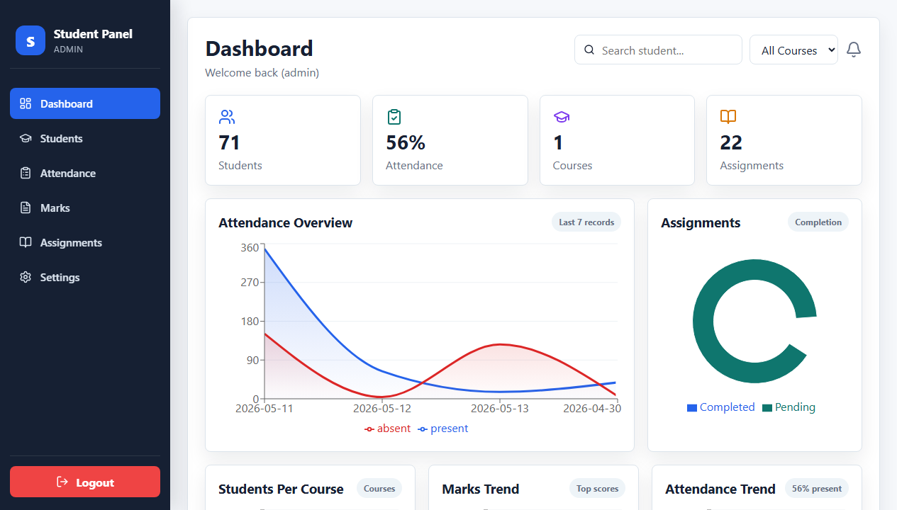

# Student Management Dashboard

A responsive student management web application built with React.js, TypeScript, Supabase, Recharts, and SweetAlert2.

This project is designed for college-level academic management. It includes modules for login, dashboard analytics, student records, attendance, assignments, marks entry, and student profile management.

## Full Project Report

The complete college-level documentation and presentation report is available here:

[PROJECT_DOCUMENTATION_AND_REPORT.md](./PROJECT_DOCUMENTATION_AND_REPORT.md)

## Project Screenshots

Screenshots used in the report are saved in:

[docs/images](./docs/images)

Preview:



## Features

- Role-based login for admin, teacher, and student users.
- Dashboard with analytics charts.
- Student add, edit, delete, search, sort, filter, and pagination.
- Attendance marking with compact responsive cards.
- Assignment marks entry with total and percentage calculation.
- Semester marks entry with IA and external marks.
- Student profile update and image upload support.
- Responsive design for desktop, tablet, and mobile screens.

## Tech Stack

- React.js
- TypeScript
- React Router DOM
- Supabase
- Recharts
- Lucide React
- SweetAlert2
- CSS

## Project Structure

```text
src/
  components/
  context/
  pages/
  services/
  types/
  App.tsx
  App.css
  index.tsx
  supabaseClient.ts
```

## Installation

Install dependencies:

```bash
npm install
```

Start development server:

```bash
npm start
```

Open in browser:

```text
http://localhost:3000
```

Create production build:

```bash
npm run build
```

## Important Pages

- `Dashboard.tsx` - Dashboard charts and summary cards.
- `students.tsx` - Student management page.
- `Attendance.tsx` - Attendance marking page.
- `Assignments.tsx` - Assignment marks page.
- `Marks.tsx` - Semester marks page.
- `personalinfo.tsx` - Student profile page.
- `login.tsx` - Login page.

## Notes

This project is suitable for academic demonstration. For production use, authentication should be upgraded with secure password handling, Supabase Auth, environment variables, and row-level security policies.
